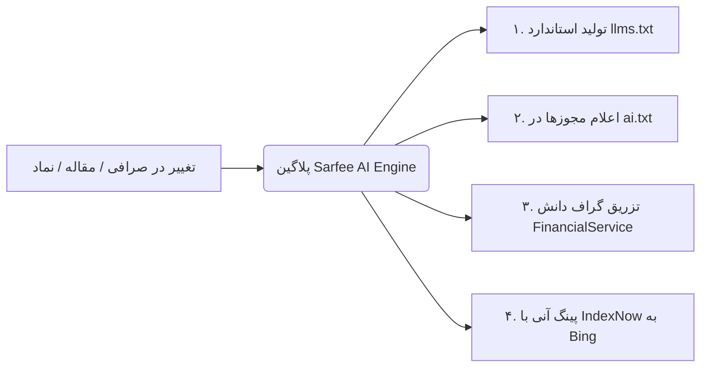

# پلتفرم جامع مقایسه و نقد صرافی‌ها | صرفی (Sarafee)

[](https://wordpress.org)
[](https://php.net)
[](https://wpastra.com)
[](https://llmstxt.org)
[](#)

این مخزن شامل هسته توسعه اختصاصی وب‌سایت **صرفی (Sarafee.uk / Sarfee.ir)** است؛ سامانه مستقل دایرکتوری، ارزیابی اعتبار، مقایسه کارمزدها و استعلام نرخ لحظه‌ای صرافی‌های رسمی، صرافی‌های ایرانیان در انگلستان و بازار مبادلات ارزی و رمزارز.

---

## 📁 ساختار مخزن (Repository Architecture)

این ریپازیتوری در سطح `wp-content` پیکربندی شده است و با استفاده از یک فایل `.gitignore` مهندسی‌شده، **منحصراً کدهای اختصاصی پروژه** را ردگیری می‌کند تا از انباشت افزونه‌های شخص ثالث، لاگ‌ها و فایل‌های حجیم مدیا جلوگیری شود:

```
wp-content/
├── themes/
│   └── astra-child/                # پوسته فرزند اختصاصی استرا (طراحی، روت‌ها و کامپوننت‌ها)
├── plugins/
│   └── sarfee-ai-engine/           # افزونه اختصاصی بهینه‌سازی موتورهای هوش مصنوعی (GEO/AEO)
├── .gitignore                      # فیلتر هوشمند فایل‌ها (فقط astra-child و sarfee-ai-engine)
└── README.md                       # مستندات جامع فنی پروژه
```

---

## 🎨 بخش اول: پوسته اختصاصی (`themes/astra-child`)

پوسته `astra-child` با رویکرد Clean Code و استانداردهای طراحی مدرن مالی پیاده‌سازی شده و امکانات زیر را ارائه می‌دهد:

### ۱. معماری اختصاصی URLها و ریرایت رول‌ها
برای مدیریت بهینه ساختار نشانی‌ها بدون تداخل با برگه پیش‌فرض بلاگ:
- **صرافی‌ها:** `/{city}/` (آرشیو شهرها مثل `/london/`) و `/{city}/{slug}/` (صفحه تکی صرافی مثل `/london/niavaran/`).
- **نمادها و ارزها:** `/{symbol}/` (صفحه اختصاصی نماد مثل `/usd/` یا `/gold/`).
- **مقالات متصل به نماد:** `/{symbol}/{post-slug}/` (بردکرامب و دسته‌بندی نماد مادر).
- **وبلاگ عمومی:** `/blog/{post-slug}/`.

### ۲. کامپوننت‌های تعاملی صرافی‌ها (`exchanges/`)
- **[exchangeDetails.php](themes/astra-child/exchanges/exchangeDetails.php):** کارت اطلاعات تماس به سبک گوگل‌مپ، بج‌های وضعیت مجوز رسمی، رتبه‌بندی و پشتیبانی از رمزارز.
- **[exchangeLicense.php](themes/astra-child/exchanges/exchangeLicense.php):** آکاردئون پیشرفته اسناد و مجوزهای ثبتی به همراه لایت‌باکس تعاملی.
- **[exchangeGoogleReviews.php](themes/astra-child/exchanges/exchangeGoogleReviews.php):** استخراج خودکار شناسه مکان (Place ID / CID) و نمایش امتیازات گوگل بدون نیاز به API Key اختصاصی.
- **[exchangeAbout.php](themes/astra-child/exchanges/exchangeAbout.php):** ماژول محتوای تحلیلی، مزایا، معایب و تاریخچه صرافی.

### ۳. ماژول‌های قیمت زنده، چارت و ماشین حساب (`symbols/`)
- **ماشین‌حساب هوشمند تبدیل:** تبدیل زنده پوند و دلار به تومان با نرخ‌های بازار آزاد.
- **چارت تعاملی TradingView:** یکپارچه‌سازی با کتابخانه سبک `lightweight-charts.js` برای نمایش نوسانات تاریخی.
- **مگامنو هدر قیمت‌ها:** نمایش زنده برترین ارزها و طلا در نوار بالای سایت بدون ایجاد شیفت چیدمان (CLS).

### ۴. وب‌هوک و اتصال اتوماسیون (`inc/rest-api.php`)
- اندپوینت‌های اختصاصی REST API برای اتصال به سناریوهای خودکارسازی **n8n** و سیستم ایمپورت داده‌های زنده بازار.

---

## 🤖 بخش دوم: موتور بهینه‌سازی هوش مصنوعی (`plugins/sarfee-ai-engine`)

افزونه اختصاصی **Sarfee AI Engine** سایت را برای نسل جدید جستجو یعنی موتورهای پاسخ‌گو (Answer Engines مانند **Perplexity**، **ChatGPT Search**، **Google Gemini AI Overviews** و **Claude**) بهینه‌سازی می‌کند:



### قابلیت‌های کلیدی افزونه:

1. **پروتکل استاندارد `llms.txt` و `llms-full.txt` (مطابق llmstxt.org):**
   - استخراج داینامیک صرافی‌ها، نمادها، مقالات و لندینگ‌های تخصصی (خرید ملک، پرداخت شهریه و...).
   - **استخراج هوشمند دسکریپشن:** درج خودکار توضیحات متای رنک‌مث (یا چکیده محتوا) جلوی لینک‌ها جهت هدایت دقیق پاسخ چت‌بات‌ها.
   - کش ۱۲ ساعته با Transient API و تخلیه خودکار رویدادمحور هنگام ثبت یا ویرایش محتوا.

2. **کنترل ربات‌ها و سیاست استناد (`ai.txt` & `robots.txt`):**
   - تعیین شرایط کپی‌رایت با الزام ذکر منبع (`Attribution: required`).
   - صدور مجوز رسمی برای ربات‌های هوش مصنوعی (`GPTBot`, `PerplexityBot`, `ClaudeBot`, `Google-Extended`).
   - تنظیم هدرهای بهینه‌ساز `X-Robots-Tag: max-snippet:-1` برای افزایش شانس دریافت سهم استناد.

3. **اسکیمای پیشرفته صرافی‌ها و اتصال به E-E-A-T گوگل:**
   - تولید خودکار JSON-LD از نوع `FinancialService` و `ExchangeOffice`.
   - اتصال به صفحات سلب مسئولیت (`publishingPrinciples`) و گزارش اشتباه (`correctionsPolicy`).
   - **هماهنگی ۱۰۰٪ با رنک‌مث:** ادغام مستقیم در هوک `rank_math/json_ld` بدون تولید کدهای تکراری.

4. **ارسال بلادرنگ تغییرات با IndexNow:**
   - اطلاع‌رسانی ثانیه‌ای به موتورهای بینگ و کوپایلت به محض به‌روزرسانی کارمزد یا اطلاعات هر صرافی.
   - مجهز به تشخیص خودکار محیط لوکال جهت جلوگیری از خطای ۴۲۹ سرورها در زمان توسعه.

5. **پیشخوان اختصاصی و راهنمای جامع:**
   - منوی مستقل در سایدبار پیشخوان وردپرس با آیکون هوش مصنوعی.
   - زیرمنوی مستندات کامل و آموزش نکات نگارش محتوا برای جلب حداکثر استناد هوش مصنوعی (AEO).

---

## 🛠 راه‌اندازی و توسعه محلی (Local Development)

### پیش‌نیازها
- **Local by Flywheel** یا هر محیط LAMP/LEMP با **PHP 8.1+**
- **WordPress 6.0+**
- قالب مادر: **Astra**

### چرخه کاری گیت (Git Workflow)
فقط فایل‌های تغییریافته در دو پوشه مجاز ثبت می‌شوند:
```bash
# بررسی وضعیت تغییرات
git status

# افزودن و ثبت کامیت
git add -A
git commit -m "feat: your feature description"

# ارسال به گیت‌هاب
git push origin main
```

---

## ⚖️ سیاست‌های تحریریه و شفافیت
- **سلب مسئولیت:** [sarafee.uk/disclaimer](https://sarafee.uk/disclaimer/)
- **گزارش محتوا و خطا:** [sarafee.uk/report-content](https://sarafee.uk/report-content/)
- **زمینه هوش مصنوعی:** [sarafee.uk/llms.txt](https://sarafee.uk/llms.txt)
- **سیاست ربات‌های AI:** [sarafee.uk/ai.txt](https://sarafee.uk/ai.txt)

---
© ۲۰۲۶ کلیه حقوق این مخزن و کدهای سفارشی برای تیم توسعه **Sarafee** محفوظ است.
